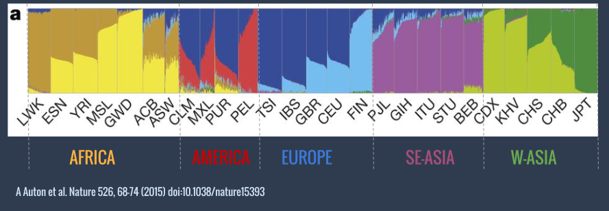
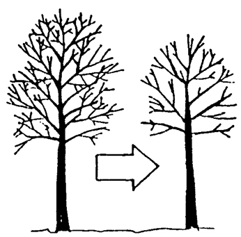
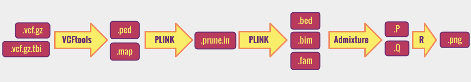

------------
> #### Learning Objectives
------------

#Summary

- [Assessment of population structure using ADMIXTURE](#section-id-44)
  - [The biological question](#section-id-46)
  - [The software required](#section-id-50)
    - [From raw data to variants](#section-id-52)
    - [Task specific](#section-id-58)
      - [ADMIXTURE](#section-id-60)
  - [Project tasks](#section-id-82)
    - [1. Copy the fastq files in your directory](#section-id-88)
    - [2. Process the NGS data](#section-id-97)
    - [3. Prepare input files for ADMIXTURE](#section-id-101)
        - [3.1 Convert  in PLINK style files](#section-id-112)
        - [Submit a job to job scheduler](#section-id-148)
        - [3.2 Generate PLINK  file](#section-id-198)
        - [3.3 Prune to reduce number of markers](#section-id-261)
        - [3.4 Prune to reduce number of markers and generate the bed simultaneously](#section-id-305)
    - [4. Run ADMIXTURE](#section-id-327)
        - [Iterating over Ks](#section-id-397)
        - [Challenge](#section-id-424)
    - [5. Interpret the output and prepare a report](#section-id-429)
  - [Recap](#section-id-435)
  - [References](#section-id-442)


<div id='section-id-44'/>

# Assessment of population structure using ADMIXTURE

<div id='section-id-46'/>

## The biological question
We want to run a  study that requires a genetically homogeneous sample of individuals. We want to use available data from a prior study that collected DNA samples and produced whole genome sequences of sixty individuals. However we do not know anything about the origin of the sample and therefore we want to check if they represent an homogeneous sample or not.


<div id='section-id-50'/>

## The software required

<div id='section-id-52'/>

### From raw data to variants

As the course will cover in very detail this part we will skip and talk only about more specific software.
In summary you will have to follow the pipeline we have applied during the practicals.


<div id='section-id-58'/>

### Task specific

<div id='section-id-60'/>

#### ADMIXTURE

We will use an algorithm that analyses the data making an hypothesis about the number of possible clusters and try to fit individuals into them. This algorithm is implemented in a software called [ADMIXTURE](https://www.genetics.ucla.edu/software/admixture/), a program for estimating ancestry in a model-based manner from large autosomal SNP genotype datasets, where the individuals are unrelated.

 Take some time to read the [ADMIXTURE manual](https://www.genetics.ucla.edu/software/admixture/admixture-manual.pdf)

ADMIXTURE produces outputs like this:

>

>This plot is from the [1000 Genomes Nature's paper](http://www.nature.com/nature/journal/v526/n7571/full/nature15393.html). Every vertical line corresponds to one individual and colors represent subdivisions in clusters according to genetic similarities. Each individual is colored with  one or more colors according to the likelihood of belonging to one or more clusters.

>Three-letters codes indicate population within continents. In some populations (e.g. JPT) individuals are genetically very similar and only one color is observed. In others (e.g. PUR) individuals belong to several clusters, some of which (e.g. dark blue) are shared among different populations. This indicates admixture between these populations.


When the program is run it ignores the geographical origin of individuals and this information is added only later in plotting the results.
This particular plot shows the case of the hypothesis of 8 clusters, represented here by 8 different colors.


<div id='section-id-82'/>

## Project tasks

The NGS tasks are not described in detail in order to stimulate the discussion in the group in the pipeline to apply. You will have to decide which aligner, variant caller and filters are best for this project and explain why.


<div id='section-id-88'/>

### 1. Copy the fastq files in your directory

The Fastq files we will use here are publicly available at the [1000 Genomes ftp site](ftp://ftp.1000genomes.ebi.ac.uk/vol1/ftp/phase3/data/).

A selected subset of `.fastq` files are in this folder:  `/pico/scratch/userexternal/vcolonna/project_1/fastq`


The  `.bam` files are in this folder:  `/pico/scratch/userexternal/vcolonna/project_1/bamfiles`


Copy in your personal data directory the ones you will work with  using the shell  `cp` command


<div id='section-id-97'/>

### 2. Process the NGS data
You will align the reads to the reference genome, refine the BAM and make QC, do the variant calling and filtering.
**Note** that:
- you need to combine all the  individual's vcf to do this analysis.   
- make  sure your vcf is [bgzipped and indexed](http://www.htslib.org/doc/tabix.html)

<div id='section-id-101'/>

### 3. Prepare input files for ADMIXTURE

ADMIXTURE takes as two options for the  **input** files:

2. binary [PLINK `.bed`](http://pngu.mgh.harvard.edu/~purcell/plink/data.shtml#bed) and associated files  [`.bim` (binary marker information)](http://pngu.mgh.harvard.edu/~purcell/plink/data.shtml#bed) and [`.fam` (pedigree)](http://pngu.mgh.harvard.edu/~purcell/plink/data.shtml#bed) all in the same directory.

3. EIGENSTRAT [`.geno`](https://github.com/DReichLab/EIG) and PLINK style [`.map`](http://pngu.mgh.harvard.edu/~purcell/plink/data.shtml#map) all in the same directory.

It is very common that a software uses the format of other softwares. In this case ADMIXTURE uses the format of the input files of two well known softwares for genetics analyses: [PLINK](http://pngu.mgh.harvard.edu/~purcell/plink/) and [EIGENSTRAT](https://github.com/DReichLab/EIG). Take some time to familiarize yourself with these input file formats.


<div id='section-id-112'/>

#####  3.1 Convert `.vcf` in PLINK style files

To generate the input file we  will use the `--plink` option of [VCFtools](https://vcftools.github.io/index.html) that converts `.vcf.gz` files in [PLINK `.ped`](http://pngu.mgh.harvard.edu/~purcell/plink/data.shtml#ped) and [PLINK `.map`](http://pngu.mgh.harvard.edu/~purcell/plink/data.shtml#map)
files:  


```
module load profile/advanced
module load vcftools

vcftools --gzvcf  tiny.vcf.gz  --plink --out tiny

```
> *note that the `module load` instruction is specific to the machine we are using*

> - `--gzvcf`  *specifies the vcf file path*
> - `--plink`  *indicates that we want to generate PLINK style files*
> - `--out`  *specifies the path and names (only prefix, extension will be added by vcftools) of the output files*


This command line will generate three output files:

```
ls -l

-rw-rw-r-- 1 user user        676 19 nov 12:17 tiny.log
-rw-rw-r-- 1 user user     257413 19 nov 12:17 tiny.map
-rw-rw-r-- 1 user user    2495639 19 nov 12:17 tiny.ped

```
>- `.log` *contains all the information of the VCFtools operation. Open it and read its content*
>- `.map` *contains a list of markers and their positions on the chromosome*
>- `.ped` *contains the genotypes*


<div id='section-id-148'/>

#####  Submit a job to job scheduler  

If we are using a very small file, the command line described above can be very fast and run interactively. However in reality files are large and we might want to submit jobs instead.

If we are using a machine with a [PBS](https://en.wikipedia.org/wiki/Portable_Batch_System) job scheduler we might want to embed the command line in a PBS script as described in the [instructions](../00-beforewestart.md) to run jobs with PBS.

The PBS script will look like:

```

#!/bin/bash
#PBS -o /absolutepath/outerr/convert.out
#PBS -e /absolutepath/outerr/convert.err
#PBS -l walltime=00:30:00
#PBS -l pvmem=8gb
#PBS -A try15_elixir
#PBS -N vcf2plink


module load profile/advanced
module load vcftools

vcftools --gzvcf /absolutepath/data/tiny.vcf.gz  --plink --out /absolutepath/tiny

```
If the job is successful, you will see three new files in your data folder

```
ls -l

-rw-rw-r-- 1 user user        676 19 nov 12:17 tiny.log
-rw-rw-r-- 1 user user     257413 19 nov 12:17 tiny.map
-rw-rw-r-- 1 user user    2495639 19 nov 12:17 tiny.ped

```
and  standard out and standard error files generated  by the PBS:

```
cd outerr

ls -l

-rw-r--r-- 1  user user 520 Nov 26 10:34 convert.err
-rw-r--r-- 1 user user   0 Nov 26 10:34 convert.out

```
The log file might go in the `convert.out`


<div id='section-id-198'/>

#####  3.2 Generate PLINK `.bed` file

Let's first clarify that the PLINK `.bed` file is not the [UCSC/ENSEMBL `.bed`](https://genome.ucsc.edu/FAQ/FAQformat.html#format1). Because these two formats have the same extension and sometimes there is confusion.

To generate a PLINK `.bed` file we use the PLINK option [`--make-bed`](http://pngu.mgh.harvard.edu/~purcell/plink/data.shtml#bed)

```
module load profile/advanced
module load gnu/4.8.3
module load plink

plink  --file data/tiny --make-bed --noweb  --out data/tiny_a

```
> *note that the `module load` instruction is specific to the machine we are using, and the `module load gnu/4.8.3`  is a prerequisite of loading PLINK*

> -  `--file` *is the option for specifying the  input file. __Note__ that there is no extension: this is a feature of plink.*
> - `--make-bed` *is the option for generating bed files*
> - `--noweb` *specify that we want to use the PLINK version installed on our machine: PLINK also gives you the opportunity to remotely connect to the PLINK server and run analysis there.*
> -  `--out`  *specifies the path and names (only prefix, extension will be add by PLINK) of the output files. __Note__ that we keep a similar name with an extension.*


As usual, rather than running the command line interactively we might want to embed the command line in a bash script and submit a job.

```
#!/bin/bash
#PBS -o /absolutepath/outerr/makebed.out
#PBS -e /absolutepath/outerr/makebed.err
#PBS -l walltime=00:30:00
#PBS -l pvmem=8gb
#PBS -A try15_elixir
#PBS -N plink2bed


module load profile/advanced
module load gnu/4.8.3
module load plink


plink  --file /absolutepath/tiny  --make-bed --noweb  --out /absolutepath/tiny_a

```


If the job is successful we will see five new files in our data directory:

```
ls

-rw-rw-r-- 1 user user    150003 19 nov 12:48 tiny_a.bed
-rw-rw-r-- 1 user user    298487 19 nov 12:48 tiny_a.bim
-rw-rw-r-- 1 user user      1500 19 nov 12:48 tiny_a.fam
-rw-rw-r-- 1 user user      2074 19 nov 12:48 tiny_a.log
-rw-rw-r-- 1 user user       960 19 nov 12:48 tiny_a.nosex

```
Although admixture takes as input only the `.bed` file, the others are equally required. Take some time to familiarize with the files on the [PLINK manual page](http://pngu.mgh.harvard.edu/~purcell/plink/data.shtml).


<div id='section-id-261'/>

##### 3.3 Prune to reduce the number of markers



Usually 10-100k markers are required for a proper ADMIXTURE analysis, whereas if you count the lines of the `.map` file you will see that we are considering many more markers. PLINK has an option to prune the number of markers.

If you take some time to read how [here](http://pngu.mgh.harvard.edu/~purcell/plink/summary.shtml#prune), you will figure out that you need a command line like this:

```
module load profile/advanced
module load gnu/4.8.3
module load plink


plink  --file data/tiny  --noweb  --indep 100 10 2  --out data/tiny_b
```
> - `--indep 1000 10 2` *prunes based on the variance inflation factor (VIF), which recursively removes SNPs within a sliding window. The parameters for --indep are: window size in SNPs (e.g. 50), the number of SNPs to shift the window at each step (e.g. 5), the VIF threshold. The VIF is 1/(1-R^2) where R^2 is the multiple correlation coefficient for a SNP being regressed on all other SNPs simultaneously. That is, this considers the correlations between SNPs but also between linear combinations of SNPs. A VIF of 10 is often taken to represent near collinearity problems in standard multiple regression analyses (i.e. implies R^2 of 0.9). A VIF of 1 would imply that the SNP is completely independent of all other SNPs. Practically, values between 1.5 and 2 should probably be used; particularly in small samples, if this threshold is too low and/or the window size is too large, too many SNPs may be removed*

> - `--noweb` *specify that we want to use the PLINK version installed on our machine: PLINK also gives you the opportunity to remotely connect to the PLINK server and run analysis there.*
> - `--out`  *specifies the path and names (only prefix, extension will be add by PLINK) of the output files. __Note__ that we keep a   similar name with an extension.*

After running the command line you will see four new files

```
ls

-rw-rw-r-- 1 user user      2211 19 nov 13:13 tiny_b.log
-rw-rw-r-- 1 user user       960 19 nov 13:13 tiny_b.nosex
-rw-rw-r-- 1 user user     16834 19 nov 13:13 tiny_b.prune.in
-rw-rw-r-- 1 user user    100579 19 nov 13:13 tiny_b.prune.out
```

In this example the `.prune.in` is the list of markers that we want to keep. Open the file and count the lines. **When using your project data play with the software parameters to obtain a list of 10,000 markers.**

```
cat tiny.map | wc -l
10000

cat tiny_b.prune.in | wc -l
1503
cat tiny_b.prune.out  | wc -l
8497
```

<div id='section-id-305'/>

##### 3.4 Prune to reduce the number of markers and generate the bed simultaneously

Once we obtain the pruned list we need to extract the markers from the original file, and as we will need to prepare a `.bed`, we can do the two operations simultaneously:

```
plink --file /absolutepath/tiny  --extract /absolutepath/tiny_b.prune.in --make-bed --out /absolutepath/tiny_c

```

If everything worked out you should have five new files in your data folder:  

```
ls

-rw-rw-r-- 1 user user     22548 19 nov 13:58 tiny_c.bed
-rw-rw-r-- 1 user user     44312 19 nov 13:58 tiny_c.bim
-rw-rw-r-- 1 user user      1500 19 nov 13:58 tiny_c.fam
-rw-rw-r-- 1 user user      2239 19 nov 13:58 tiny_c.log
-rw-rw-r-- 1 user user       960 19 nov 13:58 tiny_c.nosex
```


<div id='section-id-327'/>

### 4. Run ADMIXTURE

We are now ready to run ADMIXTURE. We read in the manual:  

> To use ADMIXTURE, you need an input file and an idea of K, your belief of the number of ancestral populations.  You should also have the associated support files alongside your main input file, in the same directory.  For example, if your primary input file is a `.bed` file,
you should have the associated `.bim` (binary marker information file) and
`.fam` (pedigree  stub file) files in the same directory.  If your primary input file is a `.ped` or `.geno` file, a corresponding PLINK style `.map` file should be in the same directory.

Once we are sure about this let's run the ADMIXTURE command line (or [embed it in a script](#sec3.3.1) to be submitted to a job scheduler):

```
module load profile/advanced
module load admixture

admixture  tiny_c.bed 2
```
> ADMIXTURE takes as input only two parameters: the path to the input file and the number of clusters (K) in which  we believe our population is subdivided, in this case K=2

If all works fine, there will be two new files in your data folder:

```
ls

-rw-rw-r-- 1 user user     27054 19 nov 14:06 tiny_c.2.P
-rw-rw-r-- 1 user user      1080 19 nov 14:06 tiny_c.2.Q
```

 - `.2.Q` is the ancestry fractions per each individual. This file has K=2 columns and as many lines as individuals described in the `.fam` file
 - `.2.P` is the allele frequencies of the inferred ancestral populations. This file has K=2 columns each containing the allele frequency of the K populations and as many lines as the loci described in the `.bim ` file. Because markers are bi-allelic only the frequency of one allele is reported as the other can be inferred from the sum=1.


Note that the output file names have '2' in them.  This indicates the number of populations (K) that was assumed for the analysis.


Beside these two files the other important information is in  the standard out and the standard error. If you run ADMIXTURE interactively  you will have the content of these files displayed on the terminal, however it is really unlikely that you will run the analyses interactively.
Therefore,  when using a PBS script make sure to give reasonable names to the standard out (e.g. .K.log) and the standard error. For instance:

```
#!/bin/bash
#PBS -q workq
#PBS -N admix
#PBS -l nodes=1:ppn=1
#PBS -o /absolutepath/outerr/admix.2.out
#PBS -e /absolutepath/outerr/admix.2.err

cd /absolutepath  # without this info you will receive an  error message saying that the `bed` associated `bim` file is not found   

module load profile/advanced
module load admixture

admixture  /absolutepath/tiny_c.bed 2

```

This set up will produce three files in your data folder:

```
ls

-rw-rw-r-- 1 user user     27054 19 nov 14:06 tiny_c.2.P
-rw-rw-r-- 1 user user      1080 19 nov 14:06 tiny_c.2.Q
-rw-rw-r-- 1 user user      1080 19 nov 14:06 tiny_c.2.log
```


After running ADMIXTURE take some time to open the `.2.Q`, `.2.P`, `.2.out` and  `.2.err` and read the content.

If all worked fine the `.2.err` should be empty!


<div id='section-id-397'/>

#####  Iterating over Ks

It is a good practice to run several times ADMIXTURE making different hypothesis on the number of clusters K and compare results after. We can change the command line adjusting for K:

```
admixture  /data/tiny_c.bed 3

```
This command line will produce three new output in the data folder:

```
ls

-rw-rw-r-- 1 user user     27054 19 nov 14:06 tiny_c.3.P
-rw-rw-r-- 1 user user      1080 19 nov 14:06 tiny_c.3.Q
-rw-rw-r-- 1 user user      1080 19 nov 14:06 tiny_c.3.log
```

ADMIXTURE implements a method to cross-validate results. Take some time to read how in the [manual](https://www.genetics.ucla.edu/software/admixture/admixture-manual.pdf). As you will figure out you need to add the `--cv` flag to the command line.

```
admixture  /data/tiny_c.bed 3 --cv

```
This will output a line in the standard out (e.g. our `.3.log` file) with the value of the CV error. As you might have read in the manual, CV errors from different K runs can be compared to decide which is the most likely number of clusters in our data set.


<div id='section-id-424'/>

#####  Challenge

Run several K and extract the information of CV from the log files


<div id='section-id-429'/>

### 5. Interpret the output and prepare a report

Here is where we want you to be creative...
Prepare two slides:
- explain the NGS pipeline
- show the results


<div id='section-id-435'/>

## Recap

To summarize, below is a list of all the task-specific softwares that we need to use. We will run some of them and use only file formats from others.

  


<div id='section-id-442'/>

## References
D.H. Alexander, J. Novembre, and K. Lange. Fast model-based estimation of
ancestry in unrelated individuals. Genome Research, 19:1655–1664, 2009.

Anil Raj, Matthew Stephens, and Jonathan K. Pritchard. fastSTRUCTURE:
Variational Inference of Population Structure in Large SNP Data Sets ,
(Genetics) June 2014 197:573-589
