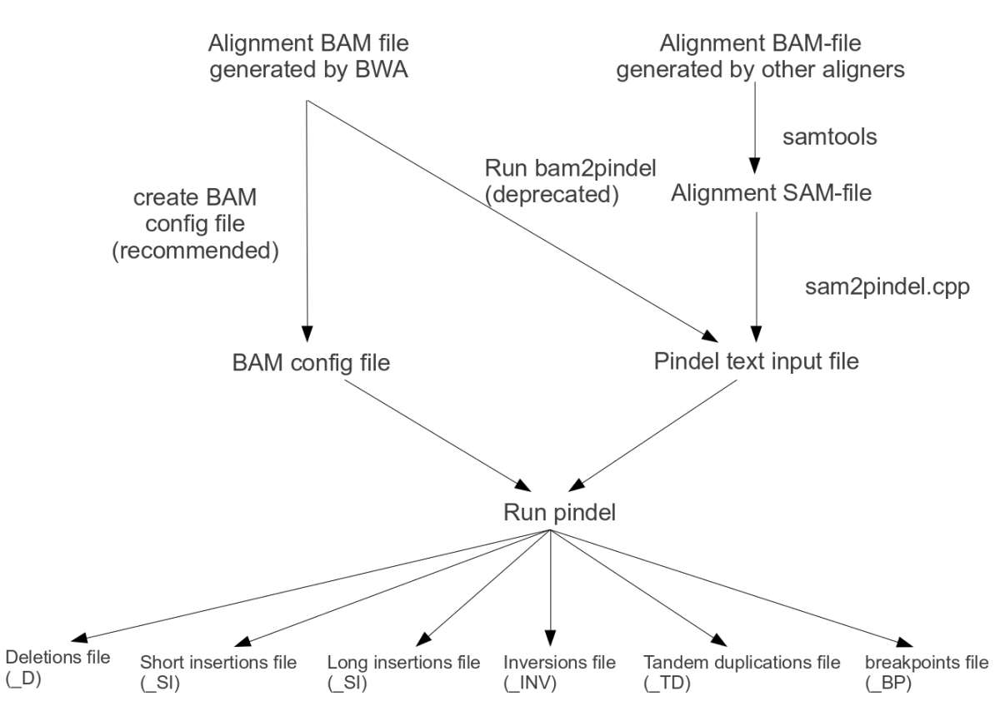

------------
> #### Learning Objectives
------------

#Structural variation (SV) calling - Handbook

*Summary*

During this practical you will take a mapped Illumina paired end data set and complete the following quality control workflow:
1. Obtain the insert size metrics for the samples using picard
2. Use Pindel to call a range of SVs
3. Convertion of pindel calls into vcf with some filtering using pindel2vcf


## SV detection using Pindel

[Pindel](http://gmt.genome.wustl.edu/packages/pindel/index.html) uses a split-read approach to identify a range of structural variations using paired-end reads. See Figure 1 for Pindel workflow and types of SVs.

Original publication: Ye et al "Pindel: a pattern growth approach to detect break points of large deletions and medium sized insertions from paired-end short reads" Bioinformatics. 2009 Nov 1;25(21):2865-71.





## Dataset description:
The data we will use comes from the following publication:

Prado-Martinez et al "Great ape genetic diversity and population history." Nature. 2013 Jul 25;499(7459):471-5

We will use data from two whole-genome sequenced chimpanzees Vaillant (Central chimpanzee, Pan troglodytes troglodytes) and Koby (Western chimpanzee, Pan troglodytes verus). Sequencing was done using Illumina HiSeq 2000 with 100bp paired-end reads. The bam files contain ~2.2Mb region of the Y chromosome (chrY: 13870437-16095787).

Raw data has already been mapped to human genome reference hg19 using bwa mem v0.7.12 followed by standard bam refinement.


## Step 1: Obtain the insert size metrics for the samples using picard

In order to use Pindel, we need to know the mean insert size of the dataset for each sample. In order to get this information, we are going to use picard 'CollectInsertSizeMetrics'.

The dataset is located at:
```
/pico/scratch/userexternal/phallast/SV/bams
```
Reference file for the dataset is located at:
```
/pico/scratch/userexternal/phallast/project2/ref
```

Make a new folder:
```
>$ cd /pico/scratch/userexternal/your_username/
>$ mkdir SV
>$ cd SV
```

Copy the files to your folder:
```
>$ cp /pico/scratch/userexternal/phallast/SV/bams/*.bam .
>$ cp /pico/scratch/userexternal/phallast/SV/bams/*.bai .
>$ cp /pico/scratch/userexternal/phallast/project2/ref/ucsc.hg19.fasta .
>$ cp /pico/scratch/userexternal/phallast/project2/ref/ucsc.hg19.dict .
>$ cp /pico/scratch/userexternal/phallast/project2/ref/ucsc.hg19.fasta.fai .
>$ cd /pico/scratch/userexternal/your_username/SV
>$ ls
```

Run picard CollectInsertSizeMetrics to obtain the mean insert size:
```
>$ module load autoload picard/1.119
>$ java -Xmx1G -jar /cineca/prod/applications/picard/1.119/binary/bin/CollectInsertSizeMetrics.jar I=PTV_Koby_Sk3_srt.bam O=PTV_Koby_Sk3_srt_InsMetr.txt H=PTV_Koby_Sk3_srt_hist.pdf
>$ ls -lat
```

To view the output files:
```
>$ more PTV_Koby_Sk3_srt_InsMetr.txt
```
Now do the same for the other sample.

#### Question: What is the mean insert size of each sample? What else can you find out from the picard CollectInsertSizeMetrics output file?


## Step 2: Use Pindel to call a range of SVs

Extraction of useful reads for Pindel from SAM/BAM files can be done using a few different option (see Pindel web page for additional information). Since our data has been mapped using bwa and Pindel can directly read in BWA/MOSAIK-generated BAM-files, we will go for the recommended option and use indexed BAM files produced by BWA on Illumina reads, via a configuration file.

We therefore need to create a small text-file containing the names of the BAM-files we want to search for indels and structural variations. On each line, list the name of the bam-file, the insert size, and the label for the sample.

The file should look like this (separated by tabs):
```
path-to-data/sample1.bam	236	sample1
path-to-data/sample2.bam	324	sample2
```

Create a Pindel configuration file using a text editor and fill it with the appropriate information from Step1.

In order to run Pindel do:
```
>$ module load profile/advanced
>$ module load autoload pindel/1.0
```

To see the full list of parameters:
```
>$ pindel -h
```

Run pindel and call SVs only from Y chromosome:
```
>$ pindel -f /pico/scratch/userexternal/your_username/SV/ucsc.hg19.fasta -i conf_file.txt -c chrY -o /pico/scratch/userexternal/your_username/SV/2chimps_pindel
```

Look at the raw calls:
```
>$ more 2chimps_pindel_D
>$ more 2chimps_pindel_SI
```

#### Question - Browsing thought the deletions output, which seems to be the most common length of these events? Which is the longest one you can find?

#### Question - How many deletions and insertions in total have been called from these samples? (hint: try the “tail” command)


## Step 3: Use pindel2vcf (conversion of Pindel output to VCF format and some filtering of SVs):

For full information about pindel2vcf options:
```
>$ pindel2vcf
```

Convert and filter short insertions (SI):
```
>$ pindel2vcf -r /pico/scratch/userexternal/your_username/SV/ucsc.hg19.fasta -R hg19 -d Feb2009 -p /pico/scratch/userexternal/your_username/SV/2chimps_pindel_SI -v /pico/scratch/userexternal/your_username/SV/2chimps_pindel_SI.vcf -c chrY -is 5 -b –e 5 -sr 13870437 -er 16095787
```

#### Question - How many small insertion calls were in the raw file and how many are in the filtered vcf? Can you find differences between the two samples?

Convert and filter deletions (D):
```
>$ pindel2vcf -r /pico/scratch/userexternal/your_username/SV/ucsc.hg19.fasta -R hg19 -d Feb2009 -p /pico/scratch/userexternal/your_username/SV/2chimps_pindel_D -v /pico/scratch/userexternal/your_username/SV/2chimps_pindel_D.vcf -c chrY -is 3 -b –e 4 -sr 13870437 -er 16095787
```

### Question - How many deletion calls were in the raw file and how many are in the filtered vcf?

As you  now also know how to use IGV to view the alignment data, try checking a few of these SVs from the bam files.

If you have time, try filtering the files using different parameters. Check also the other types of SV calls.


## Additional information about pindel parameters:

*Required parameters:*

| flag            | meaning           |
| ------------- |-------------|
| -f/ --fasta    | The reference genome sequences in fasta format  |
|-p/--pindel-file | The Pindel input file; (either this or a bam configuration file is required)|
|-i/--config-file|The bam config file; either this or a pindel input file is required. Per line: path and file name of bam, insert size and sample tag.For example: /data/tumour.bam 400  tumour|
|-o/--output-prefix | Output prefix|
|-c/--chromosome| Which chr/fragment. Pindel will process reads for one chromosome each time. ChrName must be the same as in reference sequence and in read file. '-c ALL' will make Pindel loop over all chromosomes. The search for indels and SVs can also be limited to a specific region; -c 20:10,000,000 will only look for indels and SVs after position 10,000,000 == [10M, end],-c 20:5,000,000-15,000,000 will report indels in the range between and including the bases at position 5,000,000 and 15,000,000 = [5M, 15M]|


*Parameters affecting which structural variants are reported*

| flag            | meaning           |
| ------------- |-------------|
|-x/--max_range_index |The maximum size of structural variations to be detected; the higher this number, the greater the number of SVs reported, but the computational cost and memory requirements increase, as does the rate of false positives. 1=128, 2=512, 3=2,048, 4=8,092, 5=32,368, 6=129,472, 7=517,888, 8=2,071,552, 9=8,286,208 (maximum 9, default 5)|
|-r/--report_inversions| Report inversions (default true)|
|-t/--report_duplications|Report tandem duplications (default true)|
|-l/--report_long_insertions|Report insertions of which the full sequence cannot be deduced because of their length (default true)|
|-k/--report_breakpoints| Report breakpoints (default true)|
|-s/--report_close_mapped_reads| Report reads of which only one end (the one closest to the mapped read of the paired-end read) could be mapped (default false)|
|-n/--min_NT_size| Only report inserted (NT) sequences in deletions greater than this size (default 50)|
|-v/--min_inversion_size|Only report inversions greater than this number of bases (default 50)|


*Parameters affecting sensitivity and selectivity:*

| flag            | meaning           |
| ------------- |-------------|
|-d/--min_num_matched_bases|Only consider reads as evidence if they map with more than this number of bases to the reference (default 30)|
|-a/--additional_mismatch|Pindel will only map part of a read to the reference genome if there are no other candidate positions with no more than the specified number of mismatches position. The bigger this value, the more accurate but less sensitive. (default value 1)
|-m/--min_perfect_match_around_BP|At the point where the read is split into two, there should at least be this number of perfectly matching bases between read and reference (default value 3)|
|-e/--sequencing_error_rate| The expected fraction of sequencing errors (default 0.05) -u/--maximum_allowed_mismatch_rate. Only reads with fewer mismatches with the reference genome than this fraction will be considered (default 0.1)|

*Other parameters:*

| flag            | meaning           |
| ------------- |-------------|
|-b/--breakdancer | [file name]. Pindel is able to use calls from other SV methods such as BreakDancer to further increase sensitivity and specificity. BreakDancer result or calls from any methods must in the format:ChrA LocA stringA ChrB LocB stringB other|
|-Q| [file name] The list of BreakDancer calls with Pindel support information. Format: chr  Loc_left Loc_right size type index. For example, "1	72766323 	72811840 	45516	D	11970" means the deletion event chr1:72766323-72811840 of size 45516 is reported as an event with index 11970 in Pindel report of deletion.!
|-h/--help| show the command line options of Pindel|

For parameters affecting runtime and memory usage, see Pindel web page.


*pindel2vcf parameters:*

| flag            | meaning           |
| ------------- |-------------|
|-r/--reference |The name of the file containing the reference genome: required parameter|
|-R/--reference_name|The name and version of the reference genome: required parameter|
|-d/--reference_date|The date of the version of the reference genome used: required parameter|
|-p/--pindel_output|The name of the pindel output file containing the SVs|
|-P/--pindel_output_root|The root-name of the pindel output file; this will result in one big output file containing deletions, short and long insertions, tandem duplications and inversions. For example, if the pindel output files are called sample1_D, sample1_SI, sample1_TD etc. then -P sample1 would combine the information in all those sample files into one big vcf file.|
|-v/--vcf| The name of the output vcf-file (default: name of pindel output file +".vcf"|
|-c/--chromosome| The name of the chromosome (default: SVs on all chromosomes are processed)|
|-w/--window_size| Memory saving option: the size of the genomic region in a chromosome of which structural variants are calculated separately, in millions of bases (default 300, for memory saving 100 or 50 recommended)|
|-mc/--min_coverage| The minimum number of reads to provide a genotype (default 10)|
|-he/--het_cutoff| The propertion of reads to call het (default 0.2)|
|-ho/--hom_cutoff| The propertion of reads to call het (default 0.8)|
|-is/--min_size| The minimum size of events to be reported (default 1)|
|-as/--max_size|The maximum size of events to be reported (default infinite)|
|-b/--both_strands_supported|Only report events that are detected on both strands (default false)|
|-m/--min_supporting_samples|The minimum number of samples an event needs to occur in with sufficient support to be reported (default 0)|
|-e/--min_supporting_reads|The minimum number of supporting reads required for an event to be reported (default 1)|
|-f/--max_supporting_reads|The maximum number of supporting reads allowed for an event to be reported, allows protection against miscalls in due to segmental duplications or poorly mapped regions (default infinite)|
|-sr/--region_start|The start of the region of which events are to be reported (default 0)|
|-er/--region_end| The end of the region of which events are to be reported (default infinite)|
|-ir/--max_internal_repeats|Filters out all indels where the inserted/deleted sequence is a homopolymer/microsatellite of more than X repetitions (default infinite). For example: T->TCACACA has CACACA as insertion, which is a microsattelite of 3 repeats; this would be filtered out by setting -ir to 2|
|-co/--compact_output_limit|Puts all structural variations of which either the ref allele or the alt allele exceeds the specified size (say 10 in '-co 10') in the format 'chrom pos first_base <SVType>'|
|-il/--max_internal_repeatlength|Filters out all indels where the inserted/deleted sequence is a homopolymers/microsatellite with an unit size of more than Y, combine with the option -ir. Default value of -il is infinite. For example: T->TCAGCAG has CAGCAG as insertion, which has the fundamental repetitive unit CAG of length 3. This would be filtered out if -il has been set to 3 or above, but would be deemed 'sufficiently unrepetitive' if -il is 2|
|-pr/--max_postindel_repeats| Filters out all indels where the inserted/deleted sequence is followed by a repetition (of over X times) of the fundamental repeat unit of the inserted/deleted sequence. For example, T->TCACA would usually be a normal insertion, which is not filtered out, but if the real sequence change is TCACACA->TCACACACACA, it will be filtered out by -pr of 1 or above, as the fundamental repeat unit of the inserted sequence (CA) is repeated more than one time in the postindel sequence [indel sequence CACA, postindel sequence CACACA]. Note: when CAC is inserted next to ACACAC, the repeat sequence is recognized as CA, even though the 'postrepeat' sequence is ACACAC|
|-pl/--max_postindel_repeatlength|Filters out all indels where the inserted/deleted sequence is followed by a repetition of  the fundamental repeat unit of the inserted/deleted sequence; the maximum size of that 'fundamental unit' given by the value of -pl (default infinite) For example: TCAG->TCAGCAG has insertion CAG and post-insertion sequence CAG. This insertion would be filtered out if -pl has been set to 3 or above, but would be deemed 'sufficiently unrepetitive' if -pl is 2|
|-sb/--only_balanced_samples|Only count a sample as supporting an event if it is supported by reads on both strands, minimum reads per strand given by the -ss parameter. (default false)|
|-so/--somatic_p|compute somatic p value when two samples are present, assume the order is normal and tumor. (default false)
|-ss/--minimum_strand_support|Only count a sample as supporting an event if at least one of its strands is supported by X reads (default 1)|
|-G/--gatk_compatible|calls genotypes which could either be homozygous or heterozygous not as ./1 but as 0/1, to ensure compatibility with GATK|
|-h/--help|Help|
